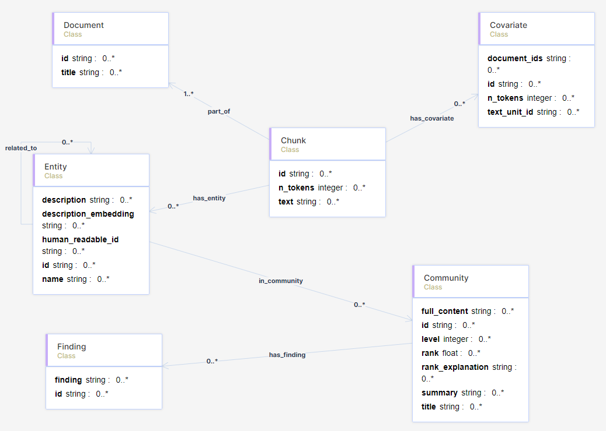

# Microsoft GraphRAG Talk

Resources to accompany my talk on Microsoft GraphRAG with an RDF Knowledge Graph.

## Streamlit Apps

There are 2 streamlit chat applications you can use and which I demonstrated in my talk. Both of these are in the [chat_app](/chat_app/) folder:

[chat_app.py](/chat_app/chat_app.py)
This queries the Knowledge Graph and then creates the context to add to the question and fetch a more meaningful answer.

[default_chat_app.py](/chat_app/default_chat_app.py)
This does not use the Knowledge Graph and simply passes the question onto our local ChatGPT to answer.

## Blog Posts

I created a 3 part series of blog posts about running Microsoft GraphRAG locally using an RDF store:

[Microsoft GraphRAG with an RDF Knowledge Graph - Part 1](https://medium.com/@ianormy/microsoft-graphrag-with-an-rdf-knowledge-graph-part-1-00a354afdb09)

Using a local LLM & Encoder to do Microsoft’s GraphRAG.

[Microsoft GraphRAG with an RDF Knowledge Graph - Part 2](https://medium.com/@ianormy/microsoft-graphrag-with-an-rdf-knowledge-graph-part-2-d8d291a39ed1)

Uploading the output from Microsoft’s GraphRAG into an RDF Store.

[Microsoft GraphRAG with an RDF Knowledge Graph - Part 3](https://medium.com/@ianormy/microsoft-graphrag-with-an-rdf-knowledge-graph-part-3-328f85d7dab2)

Using SPARQL and the Knowledge Graph for RAG.

## GitHub for Blog Posts

I also created a GitHub repository to accompany the Blog Posts which also contains notebooks, settings, etc.:

[https://github.com/ianormy/msft_graphrag_blog](https://github.com/ianormy/msft_graphrag_blog)

## Data

The ontology file is in the data folder:

[msft-graphrag.owl](data/msft-graphrag.owl)

All the other data files are on my Google Drive [here](https://drive.google.com/drive/folders/1JzMiaOo3UomwPlhn0_g7j8xsnxvEHDqf?usp=sharing)